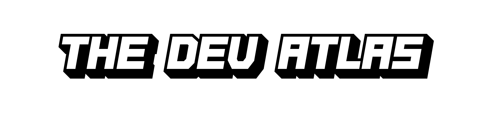

# TheDevAtlas Brand Guidelines

Welcome to the official branding repository for **TheDevAtlas**. This document serves as a comprehensive guide to the brand identity, logo usage, and visual assets.

## 📋 Logo Variations (2025)

### Primary Logos
| Standard | With Glow Effect |
|----------|------------------|
|  |  |
| Core brand identity with clean lines | Special variant with glow effect for digital applications and dark themes |

### Primary Word Marks
| Standard | With Glow Effect |
|----------|------------------|
|  |  |
| Standalone word mark with typography | Special effect variant for digital and interactive applications |

### Background Variants
| Logo with Background | Word Mark with Background |
|---------------------|---------------------------|
|  |  |
| Basic logo with background | Word mark with background |

### Additional Variants

#### Text-Only Version

Pure text version for applications where only typography is needed or for combined use with the clean logo on the side.

**© 2025 TheDevAtlas. All rights reserved.**
