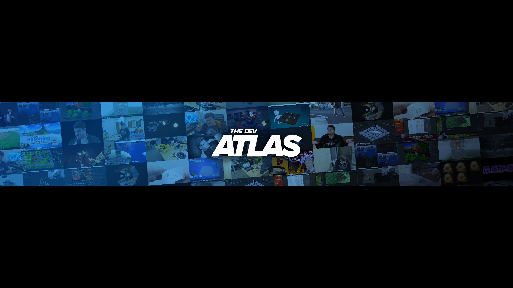

# Brand Kit

**Centralized branding assets, logos, banners, and media resources.**

---

---

| **Logo** | **White** | **Black** | **Blue** |
|:---:|:---:|:---:|:---:|
|  |  |  |  |

| **Banner** | **GitHub Banner** |
|:---:|:---:|
|  |  |

### Source Files

Source files are located in [`_Core/Source/`](_Core/Source/).

| File | Type |
|:---|:---|
| `Logo.ai` | Logo source |
| `Banner.ai` | Banner source |

