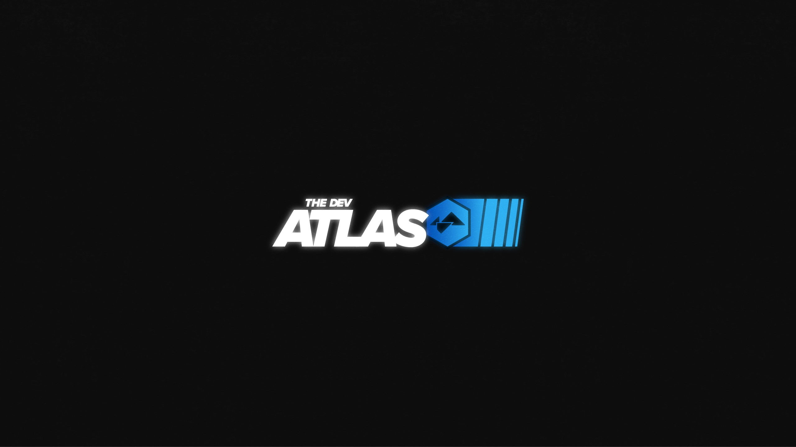

# Brand Kit

**Centralized branding assets, logos, banners, and media resources.**

---

---

## Logos

| | |
|:---:|:---:|
| **Logo Glow** | **GitHub Logo** |
|  |  |

## Banners

| **Banner Glow** |
|:---:|
|  |

| **GitHub Banner** |
|:---:|
|  |

| **Itch.io Banner** |
|:---:|
|  |

---

### Source Files

Source `.ai` files are located in [`_Core/Source/`](_Core/Source/).

